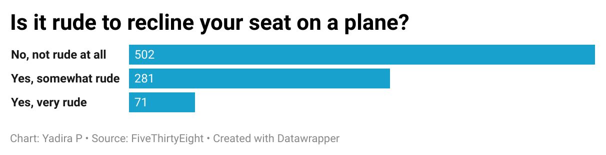

# question-6

## Thoughts on recline your seat on a plane

Based on the data on flying etiquette, the question that I ask myself when I fly is weather it is rude to recline your seat? I see others do it but for some reason I can't bring myself to do it. Looking at the data that was gathered I was able to produce the following chart:

I found it interesting that a majority of the respondents agreed that it wasn't rude to recline their chair. But there was still a good amount of people that viewed it as rude. A little under 10% of the respondents viewed it as very rude. That being said, this makes me feel a little releived. Next time I'm on a plane, I won't feel as guilty if I have to recline me seat.
